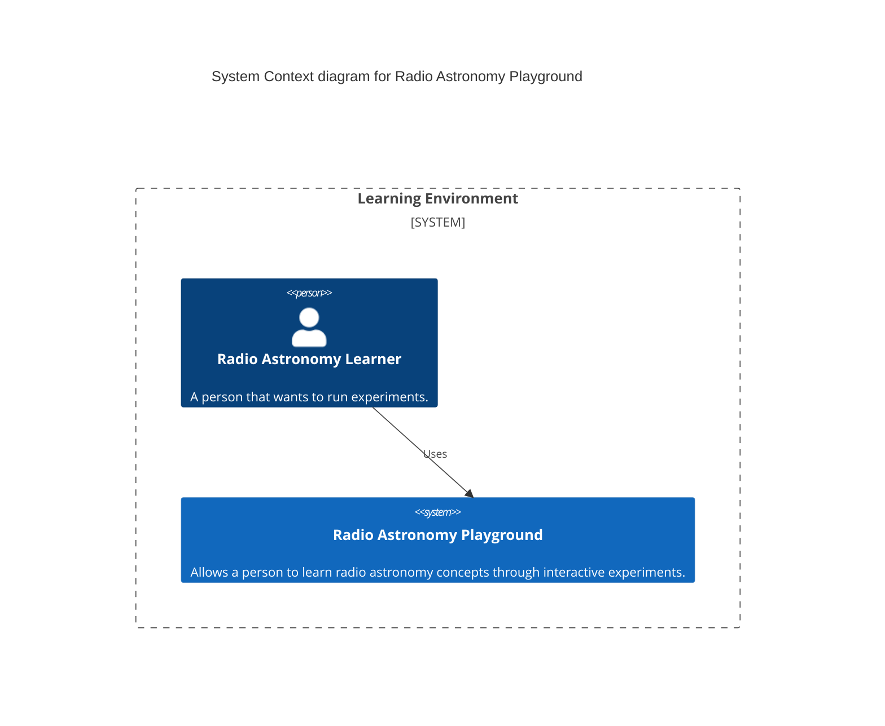
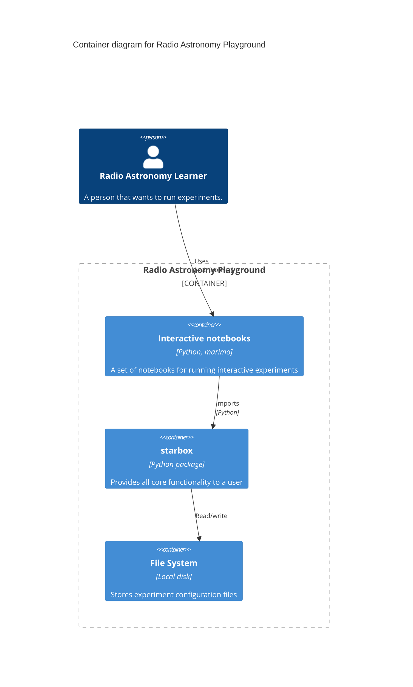
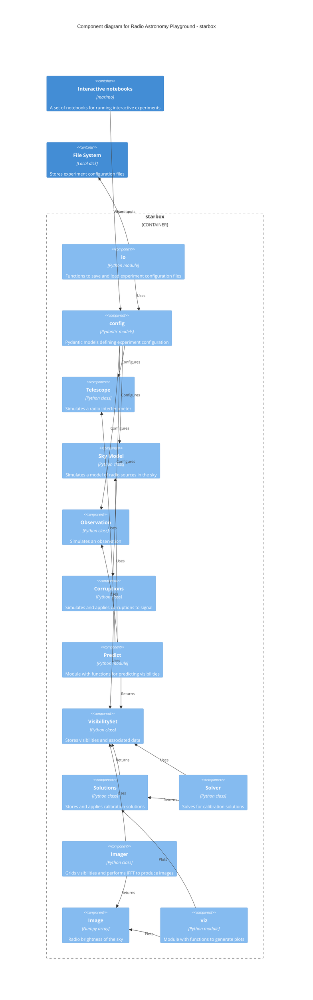
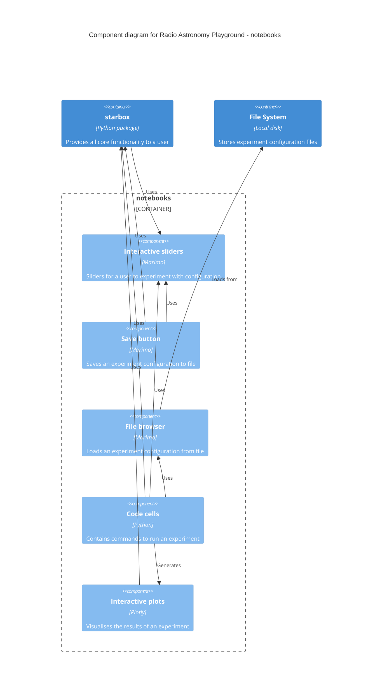

# C4 diagrams for Radio Astronomy Playground

## System Context

```mermaid
C4Context
    title System Context diagram for Radio Astronomy Playground
    System_Boundary(b0, "Learning Environment", "Environment") {
        Person(user, "Radio Astronomy Learner", "A person that wants to run experiments.")
        System(SystemAA, "Radio Astronomy Playground", "Allows a person to learn radio astronomy concepts through interactive experiments.")
    }
    Rel(user, SystemAA, "Uses")

```

## Container

```mermaid
C4Container
title Container diagram for Radio Astronomy Playground

Person(user, "Radio Astronomy Learner", "A person that wants to run experiments.")

Container_Boundary(c1, "Radio Astronomy Playground") {
    Container(notebooks, "Interactive notebooks", "Python, marimo", "A set of notebooks for running interactive experiments")
    Container(starbox, "starbox", "Python package", "Provides all core functionality to a user")
    Container(filesystem, "File System", "Local disk", "Stores experiment configuration files")
}
Rel(starbox, filesystem, "Read/write")
Rel(user, notebooks, "Uses", "web browser")
Rel(notebooks, starbox, "Imports", "Python")
```

## Component - starbox

```mermaid
C4Component
title Component diagram for Radio Astronomy Playground - starbox

Container(notebooks, "Interactive notebooks", "marimo", "A set of notebooks for running interactive experiments")
Container(filesystem, "File System", "Local disk", "Stores experiment configuration files")

Container_Boundary(starbox, "starbox") {
    Component(io, "io", "Python module", "Functions to save and load experiment configuration files")
    Component(config, "config", "Pydantic models", "Pydantic models defining experiment configuration")

    Component(telescope, "Telescope", "Python class", "Simulates a radio interferometer")
    Component(skymodel, "Sky Model", "Python class", "Simulates a model of radio sources in the sky")
    Component(observation, "Observation", "Python class", "Simulates an observation")
    Component(corruptions, "Corruptions", "Python class", "Simulates and applies corruptions to signal")
    Component(predict, "Predict", "Python module", "Module with functions for predicting visibilities")
    Component(visibility_set, "VisibilitySet", "Python class", "Stores visibilities and associated data")

    Component(solutions, "Solutions", "Python class", "Stores and applies calibration solutions")
    Component(solver, "Solver", "Python class", "Solves for calibration solutions")
    Component(imager, "Imager", "Python class", "Grids visibilities and performs iFFT to produce images")
    Component(image, "Image", "Numpy array", "Radio brightness of the sky")
    Component(viz, "viz", "Python module", "Module with functions to generate plots")

    Rel(solver, visibility_set, "Uses")
    Rel(solver, solutions, "Returns")

    Rel(corruptions, visibility_set, "Returns")
    Rel(corruptions, visibility_set, "Uses")
    Rel(predict, visibility_set, "Returns")
    Rel(predict, skymodel, "Uses")
    Rel(predict, telescope, "Uses")
    Rel(predict, observation, "Uses")
    Rel(imager, visibility_set, "Uses")
    Rel(imager, image, "Returns")
    Rel(solutions, visibility_set, "Returns")

    Rel(viz, solutions, "Plots")
    Rel(viz, image, "Plots")

}
Rel(notebooks, config, "User inputs")
Rel(config, telescope, "Configures")
Rel(config, observation, "Configures")
Rel(config, skymodel, "Configures")
Rel(config, corruptions, "Configures")
Rel(io, config, "Uses")
Rel(io, filesystem, "Writes to")
```

## Component - notebooks

```mermaid
C4Component
title Component diagram for Radio Astronomy Playground - notebooks
Container(starbox, "starbox", "Python package", "Provides all core functionality to a user")
Container(filesystem, "File System", "Local disk", "Stores experiment configuration files")

Container_Boundary(notebooks, "notebooks") {
    Component(sliders, "Interactive sliders", "Marimo", "Sliders for a user to experiment with configuration")
    Component(savebutton, "Save button", "Marimo", "Saves an experiment configuration to file")
    Component(filebrowser, "File browser", "Marimo", "Loads an experiment configuration from file")
    Component(experiment, "Code cells", "Python", "Contains commands to run an experiment")
    Component(plots, "Interactive plots", "Plotly", "Visualises the results of an experiment")

    Rel(experiment, sliders, "Uses")
    Rel(savebutton, sliders, "Uses")
    Rel(experiment, plots, "Generates")
    Rel(experiment, filebrowser, "Uses")

}
Rel(starbox, sliders, "Uses")
Rel(experiment, starbox, "Uses")
Rel(plots, starbox, "Uses")
Rel(filebrowser, filesystem, "Loads from")
Rel(savebutton, starbox, "Uses")
```
