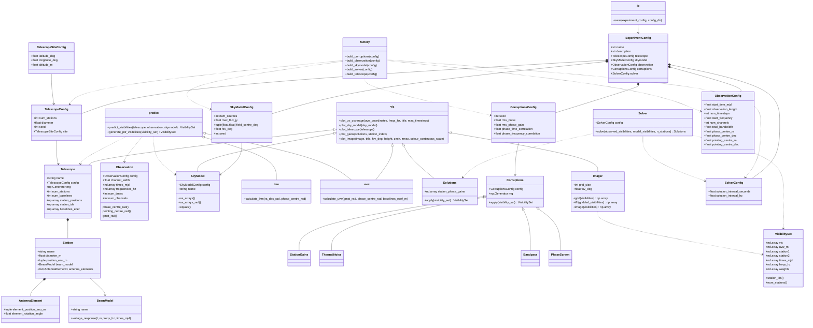

# Domain model

This shows the core domain-driven-design (DDD) aggregates (groups of domain concepts treated as a unit) and domain services (performs domain operations) that are part of starbox.

## Aggregate roots
- Telescope
- Observation
- SkyModel

## Aggregates
- Station (inside Telescope)
- AntennaElement (inside Station)

## Value objects
- ExperimentConfig
- ObservationConfig
- TelescopeConfig
- TelescopeSiteConfig
- SkyModelConfig
- CorruptionsConfig
- SolverConfig

## Strategies
- Corruptions
- BeamModel

## Services
- Solver
- Imager
- predict
- viz
- io
- lmn
- uvw
- factory

## Derived artifacts
- VisibilitySet
- Solutions

```mermaid
classDiagram
    TelescopeSiteConfig --> TelescopeConfig
    TelescopeConfig --> Telescope
    Telescope *-- Station
    Station *-- AntennaElement
    Station --> BeamModel

    predict ..> Telescope
    predict ..> Observation
    predict ..> SkyModel
    predict <|-- lmn
    predict <|-- uvw

    viz <|-- SkyModel
    viz <|-- Telescope
    viz <|-- uvw
    viz <|-- Solutions
    viz <|-- Imager

    SkyModelConfig --> SkyModel

    CorruptionsConfig --> Corruptions
    Corruptions <|-- StationGains
    Corruptions <|-- ThermalNoise
    Corruptions <|-- Bandpass
    Corruptions <|-- PhaseScreen

    Imager ..> VisibilitySet
    Solver ..> VisibilitySet
    Solver ..> Solutions
    Solver ..> SolverConfig

    io ..> ExperimentConfig
    factory ..> CorruptionsConfig
    factory ..> TelescopeConfig
    factory ..> ObservationConfig
    factory ..> SolverConfig
    factory ..> SkyModelConfig

    ExperimentConfig *-- TelescopeConfig
    ExperimentConfig *-- SkyModelConfig
    ExperimentConfig *-- ObservationConfig
    ExperimentConfig *-- CorruptionsConfig
    ExperimentConfig *-- SolverConfig

    class ExperimentConfig {
        +str name
        +str description
        +TelescopeConfig telescope
        +SkyModelConfig skymodel
        +ObservationConfig observation
        +CorruptionsConfig corruptions
        +SolverConfig solver
    }

    class TelescopeSiteConfig {
        +float latitude_deg
        +float longitude_deg
        +float altitude_m
    }
    class TelescopeConfig{
        +int num_stations
        +float diameter
        +int seed
        +TelescopeSiteConfig site

    }
    class Telescope{
        +string name
        +TelescopeConfig config
        +np.Generator rng
        +int num_stations
        +int num_baselines
        +np.array station_positions
        +np.array station_ids
        +np.array baselines_ecef
    }

    class Station{
      +string name
      +float diameter_m
      +tuple position_enu_m
      +BeamModel beam_model
      +list~AntennaElement~ antenna_elements
    }

    class AntennaElement{
      +tuple element_position_enu_m
      +float element_rotation_angle
    }

    class SkyModelConfig{
        +int num_sources
        +float max_flux_jy
        +tuple[float,float] field_centre_deg
        +float fov_deg
        +int seed
    }

    class SkyModel{
        +SkyModelConfig config
        +string name
        +as_arrays()
        +as_arrays_rad()
        +equals()
    }

    class ObservationConfig{
        +float start_time_mjd
        +float observation_length
        +int num_timesteps
        +float start_frequency
        +int num_channels
        +float total_bandwidth
        +float phase_centre_ra
        +float phase_centre_dec
        +float pointing_centre_ra
        +float pointing_centre_dec
    }

    class Observation{
        +ObservationConfig config
        +float channel_width
        +nd.array times_mjd
        +nd.array frequencies_hz
        +int num_times
        +int num_channels
        phase_centre_rad()
        pointing_centre_rad()
        gmst_rad()
    }

    class predict{
        +predict_visibilities(telescope, observation, skymodel) VisibilitySet
        +generate_psf_visibilities(visibility_set) VisibilitySet
    }

    class VisibilitySet{
        +nd.array vis
        +nd.array uvw_m
        +nd.array station1
        +nd.array station2
        +nd.array times_mjd
        +nd.array freqs_hz
        +nd.array weights
        +station_ids()
        +num_stations()
    }

    class SolverConfig {
        +float solution_interval_seconds
        +float solution_interval_hz
    }

    class Solver{
        +SolverConfig config
        +solve(observed_visibilities, model_visibilities, n_stations) Solutions
    }

    class Solutions{
        +nd.array station_phase_gains
        +apply(visibility_set) VisibilitySet
    }

    class BeamModel{
        +string name
        +voltage_response(l, m, freqs_hz, times_mjd)
    }

    class CorruptionsConfig{
        +int seed
        +float rms_noise
        +float rms_phase_gain
        +float phase_time_correlation
        +float phase_frequency_correlation
    }
    class Corruptions{
        +CorruptionsConfig config
        +np.Generator rng
        +apply(visibility_set) VisibilitySet
    }

    class lmn {
            +calculate_lmn(ra_dec_rad, phase_centre_rad)
    }
    class uvw {
            +calculate_uvw(gmst_rad, phase_centre_rad, baselines_ecef_m)
    }

    class Imager {
        +int grid_size
        +float fov_deg
        +grid(visibilities) np.array
        +ifft(gridded_visibilities) np.array
        +image(visibilities) np.array
    }

    class io {
        +save(experiment_config, config_dir)
    }

    class factory {
        +build_corruptions(config)
        +build_observation(config)
        +build_skymodel(config)
        +build_solver(config)
        +build_telescope(config)
    }

    class viz {
        +plot_uv_coverage(uvw_coordinates, freqs_hz, title, max_timesteps)
        +plot_sky_model(sky_model)
        +plot_telescope(telescope)
        +plot_gains(solutions, station_index)
        +plot_image(image, title, fov_deg, height, zmin, zmax, colour_continuous_scale)
    }
```
