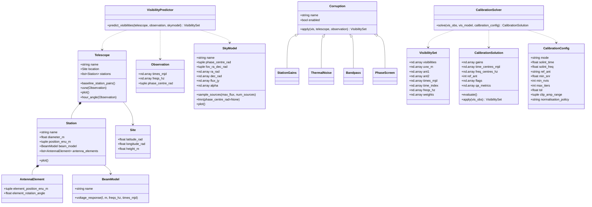

# Domain model

This shows the core domain-driven-design (DDD) aggregates (groups of domain concepts treated as a unit) and domain services (performs domain operations) that are part of starbox.

## Aggregate roots
- Telescope
- Observation
- SkyModel

## Aggregates
- Station (inside Telescope)
- AntennaElement (inside Station)

## Value objects
- Site
- CalibrationConfig

## Strategies
- Corruption
- BeamModel

## Services
- CalibrationSolver
- VisibilityPredictor

## Derived artifacts
- VisibilitySet
- CalibrationSolution

