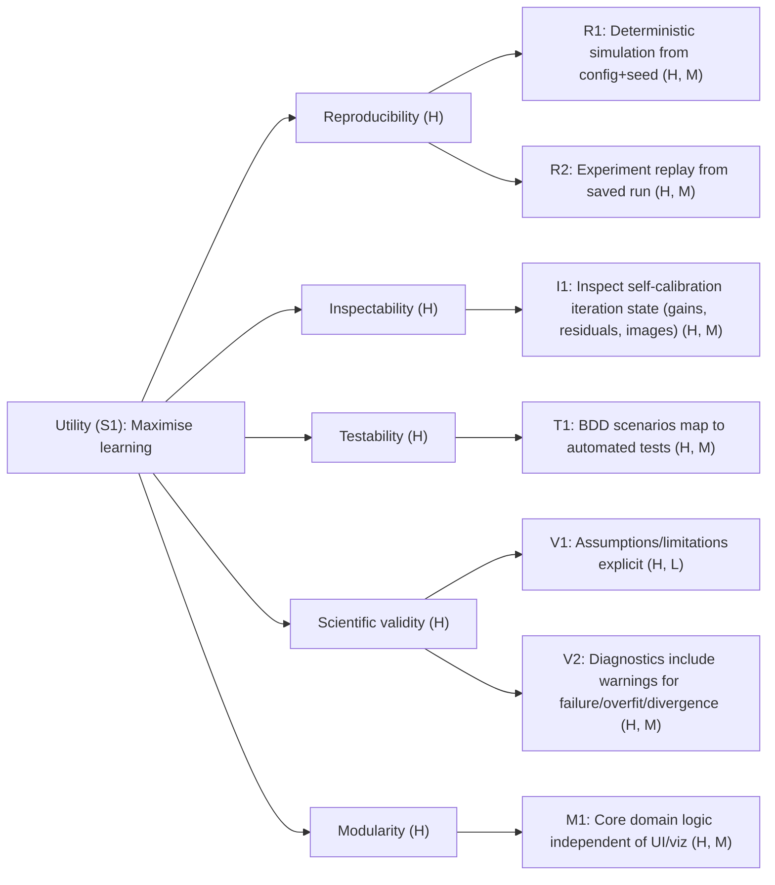

# S1: Self-calibration loop + diagnostics (MVP)

This page documents the non-functional requirements for a minimal viable product (MVP) for Radio Astronomy Playground, corresponding to deliverable slice 1 shown in the [impact map](../vision/impact-map.md). They are formulated as quality attribute scenarios and organised into a utility tree.

The main goal of Radio Astronomy Playground is to build intuition for self-calibration and imaging. Qualities that facilitate learning are therefore prioritised over performance.

## Quality attributes
- **Reproducibility**: running the same configuration, inputs, and random seed generates identical results
- **Inspectability**: data can be inspected before and after each transformation
- **Testability**: automated tests verify behaviour defined by BDD scenarios, enabling safe refactoring and regression detection.
- **Scientific validity**: assumptions and limitations are clear and diagnostics are not open to misinterpretation
- **Modularity**: software has components with clear boundaries and stable interfaces so that core domain logic can evolve independently of UI and visualisation choices

## Utility tree
The following organises quality attributes into a tree that branches into specific quality attribute issues. The issues are ranked for high (H), medium (M) or low (L) importance and difficulty.

## Quality Attribute Scenarios

---

### QAS-001 — Inspectability (I1)

**Quality attribute**: Inspectability

**Stimulus**: A self-calibration iteration completes.

**Context**: The system is running in exploratory mode during an interactive experiment.

**Artifact**: Self-calibration loop state (gain solutions, residual visibilities, images).

**Response**: The system exposes the gain solutions, residual visibilities, and images produced by that iteration without recomputing previous iterations.

**Response measure**: Per-iteration artifacts are accessible via the experiment or pipeline API, and accessing them does not trigger recomputation of earlier iterations.

---

### QAS-002 — Testability (T1)

**Quality attribute**: Testability

**Stimulus**: BDD-based regression tests are executed.

**Context**: The system is running in CI using simulation fixtures and fixed random seeds.

**Artifact**: Visibility prediction outputs, calibration solutions, and diagnostic metrics.

**Response**: The system produces reproducible outputs and fails tests when results deviate beyond defined tolerance bounds.

**Response measure**: CI fails if any numeric output exceeds configured tolerance thresholds; otherwise, all tests pass deterministically across repeated CI runs.

---

### QAS-003 — Reproducibility (R1)

**Quality attribute**: Reproducibility

**Stimulus**: A simulation is generated using a configuration with an explicit random seed.

**Context**: The system is running under the same code version and runtime environment.

**Artifact**: Sky model, station layout, observation and predicted visibilities.

**Response**: The system generates identical artifacts across repeated runs.

**Response measure**: All generated artifacts are numerically identical within tolerance across repeated executions.

---

### QAS-004 — Reproducibility (R2)

**Quality attribute**: Reproducibility

**Stimulus**: A previously saved experiment run is loaded.

**Context**: The system is running in a new session without recomputing simulation or calibration steps.

**Artifact**: Saved experiment configuration, per-iteration outputs, and diagnostics.

**Response**: The system reconstructs the artifacts required to regenerate diagnostics and analyses.

**Response measure**: Regenerated diagnostics match the original outputs within tolerance, without invoking recomputation.

---

### QAS-005 — Scientific Validity (V1)

**Quality attribute**: Scientific validity

**Stimulus**: A user runs an MVP experiment.

**Context**: The experiment relies on simplified assumptions (e.g. scalar Stokes I, no w-term, no DDE, no CLEAN).

**Artifact**: Experiment outputs (images, diagnostics, calibration solutions).

**Response**: The system presents the active assumptions and known limitations alongside the results.

**Response measure**: All outputs visibly include the active assumptions and out-of-scope effects at the time results are displayed.

---

### QAS-006 — Scientific Validity (V2)

**Quality attribute**: Scientific validity

**Stimulus**: Diagnostics are generated for a self-calibration iteration or completed run.

**Context**: The run exhibits indicators of failure, divergence, or overfitting.

**Artifact**: Diagnostic metrics and summary reports.

**Response**: The system emits warnings linked to specific measurable triggers and thresholds.

**Response measure**: Each warning references at least one metric and threshold, and warnings are present whenever predefined failure conditions are met.

---

### QAS-007 — Modularity (M1)

**Quality attribute**: Modularity

**Stimulus**: The core library is imported and executed.

**Context**: UI and visualisation dependencies are not installed.

**Artifact**: Core simulation, prediction, and calibration modules.

**Response**: The system imports and executes core functionality without requiring UI or visualisation libraries.

**Response measure**: All core modules import successfully and pass functional tests in an environment where UI dependencies are absent.
