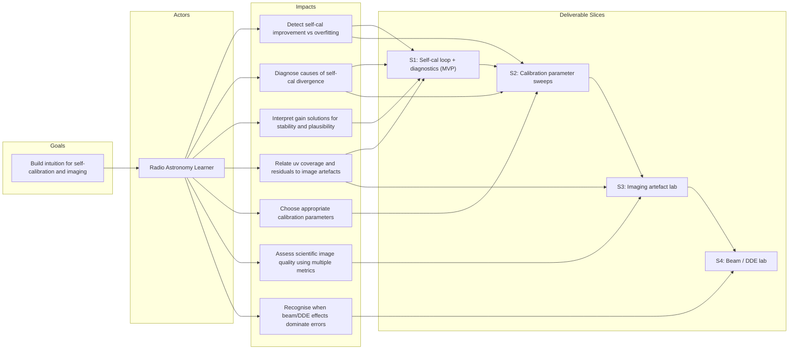

# Impact map

Calibration and imaging workflows in radio astronomy are complex, involving many interacting parameters and iterative decision-making. This expert knowledge must be encoded into production pipelines. This project is explicitly focused on building intuition for these processes, especially self-calibration, through controlled, interactive experiments and diagnostics.

The impact map below captures the main goal of the project and links it to who it is designed for (a learner of radio astronomy), the behavioural impacts we want to enable and the deliverable slices that support those impacts.

The map is not a fixed feature roadmap or a complete product specification. It is a tool for prioritising what to implement next and a way to keep development focused on learning outcomes. The map will evolve over time as experiments reveal misconceptions and incorrect assumptions.

### Minimum Viable Learning Loop (MVP)

The initial implementation focuses on **Slice S1: Self-cal loop + diagnostics**.
This slice establishes the minimal end-to-end loop required to:

1. Simulate sky model with 1-5 point sources
2. Simulate telescope, a few stations
3. Simulate observation, a few channels, a few hours
4. Predict visibilities from sky model, no w-term
5. Add phase-only corruptions and noise to visibilities
6. Solve for and apply calibration solutions
8. Image the result before and after calibration
9. Evaluate outcomes using multiple diagnostics

All subsequent slices depend on this loop. Features not directly supporting this slice are intentionally deferred.
